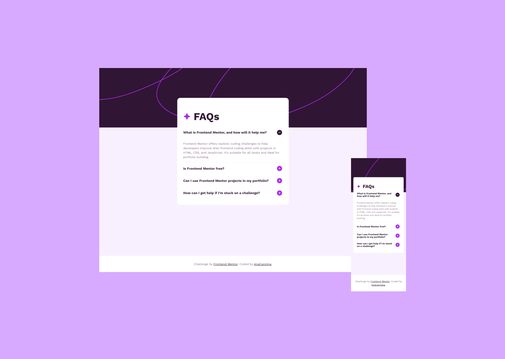

# Frontend Mentor - FAQ accordion solution

This is a solution to the [FAQ accordion challenge on Frontend Mentor](https://www.frontendmentor.io/challenges/faq-accordion-wyfFdeBwBz). Frontend Mentor challenges help you improve your coding skills by building realistic projects.

## Table of contents

- [Overview](#overview)
  - [The challenge](#the-challenge)
  - [Screenshot](#screenshot)
  - [Links](#links)
- [My process](#my-process)
  - [Built with](#built-with)
  - [What I learned](#what-i-learned)
  - [Continued development](#continued-development)
  - [Useful resources](#useful-resources)
- [Author](#author)

## Overview

### The challenge

Users should be able to:

- Hide/Show the answer to a question when the question is clicked
- Navigate the questions and hide/show answers using keyboard navigation alone
- View the optimal layout for the interface depending on their device's screen size
- See hover and focus states for all interactive elements on the page

### Screenshot

### Links

- Solution URL: 
- Live Site URL: 

## My process

### Built with

- Semantic HTML5 markup
- Progressive enhancement workflow
- CSS custom properties
- Flexbox
- CSS Grid
- Mobile-first workflow
- JavaScript
- Windows Narrator and Lighthouse for accessibility test

### What I learned

In this step of the Introduction to web accessibility learning path, the challenge was to search for a good accordion pattern and to test it manually and using automatic tools. While researching, I came across the Aria and the UK GOV examples, which I used to base my solution to this challenge. To test its accessibility, I learned about and used the Windows Narrator for a manual test and Google Lighthouse for automatic testing (100 in Accessibility).

### Continued development

I intend to continue using progressive enhancement to develop web apps and learn more accessibility testing tools to ensure a better user experience.

### Useful resources

- [Accordion Example - ARIA](https://www.w3.org/WAI/ARIA/apg/patterns/accordion/examples/accordion/)
- [Accordion - GOV.UK](https://design-system.service.gov.uk/components/accordion/)
- [Building a resilient frontend using progressive enhancement - GOV.UK](https://www.gov.uk/service-manual/technology/using-progressive-enhancement) - it helped me understand what Progressive Enhancement is and its importance.
- [Details / Summary Are Not [insert control here]](https://adrianroselli.com/2019/04/details-summary-are-not-insert-control-here.html) - it explains why the `
` element is not the best option for an accordion
- [Build a responsive, animated, accessible accordion that looks pretty good - Kevin Powell](https://youtu.be/WJERnXiFFug?si=fNtPL2gyQ4M20qlD) - it's a good accordion tutorial
- [The simple trick to transition from height 0 to auto with CSS](https://youtu.be/B_n4YONte5A?si=__9SjczcicFS6hog) - it helped me add the open/close animation.

## Author

- Frontend Mentor - [AnaCarolina](https://www.frontendmentor.io/profile/AnaCarol2001)
